# SSL 2.0 和 SSL 3.0 协议详细技术文档

## 目录
- [1. 协议概述](#1-协议概述)
- [2. SSL 2.0 详细分析](#2-ssl-20-详细分析)
- [3. SSL 3.0 详细分析](#3-ssl-30-详细分析)
- [4. 协议比较](#4-协议比较)
- [5. 安全性分析](#5-安全性分析)
- [6. 技术实现细节](#6-技术实现细节)

## 1. 协议概述

### 1.1 SSL协议的历史背景

SSL（Secure Sockets Layer）协议是由Netscape公司在1990年代开发的网络安全协议，目的是为互联网通信提供安全保障。

**发展历程：**
- **SSL 1.0**: 1994年，从未公开发布（存在严重安全缺陷）
- **SSL 2.0**: 1995年2月发布，第一个公开版本
- **SSL 3.0**: 1996年发布，对SSL 2.0的重大改进
- **TLS 1.0**: 1999年，SSL 3.0的标准化版本（RFC 2246）

### 1.2 协议架构层次

```
+------------------------+
|     应用层协议          |
|   (HTTP, FTP, SMTP)    |
+------------------------+
|      SSL/TLS层         |
|  (握手协议+记录协议)    |
+------------------------+
|      传输层协议         |
|       (TCP)           |
+------------------------+
|      网络层协议         |
|       (IP)            |
+------------------------+
```

## 2. SSL 2.0 详细分析

### 2.1 协议设计目标

SSL 2.0 设计时主要考虑以下安全目标：

1. **身份认证（Authentication）**: 验证通信对方的身份
2. **数据机密性（Confidentiality）**: 防止数据被窃听
3. **数据完整性（Integrity）**: 防止数据被篡改

### 2.2 SSL 2.0 消息格式

#### 2.2.1 记录层格式

```
SSL 2.0 记录格式:
+--------+--------+--------+--------+
|   长度   |  类型  |    数据载荷     |
| (2字节) | (1字节)|   (变长)       |
+--------+--------+--------+--------+
```

**字段说明：**
- **长度字段**: 15位长度 + 1位安全位（MSB为0表示无填充，为1表示有填充）
- **类型字段**: 消息类型标识
- **数据载荷**: 实际传输的数据

#### 2.2.2 消息类型

| 类型值 | 消息名称 | 描述 |
|-------|---------|------|
| 0x01 | CLIENT-HELLO | 客户端问候消息 |
| 0x02 | CLIENT-MASTER-KEY | 客户端主密钥消息 |
| 0x03 | CLIENT-FINISHED | 客户端完成消息 |
| 0x04 | SERVER-HELLO | 服务器问候消息 |
| 0x05 | SERVER-VERIFY | 服务器验证消息 |
| 0x06 | SERVER-FINISHED | 服务器完成消息 |
| 0x07 | REQUEST-CERTIFICATE | 请求证书消息 |
| 0x08 | CLIENT-CERTIFICATE | 客户端证书消息 |

### 2.3 SSL 2.0 握手流程详解

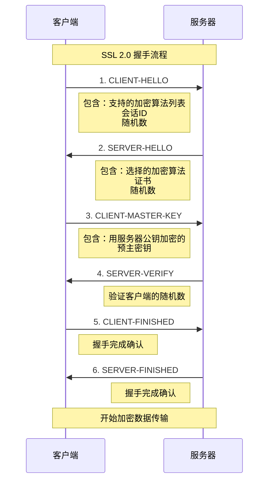

#### 2.3.1 详细握手步骤

**步骤1: CLIENT-HELLO消息**
```
CLIENT-HELLO消息结构:
+--------+--------+--------+--------+--------+
| MSG-ID |VERSION | CIPHER-| SESSION|CHALLENGE|
|(1字节) |(2字节) |SPECS-LEN|-ID-LEN |(变长)   |
+--------+--------+--------+--------+--------+
|CHALLENGE-DATA   |SESSION-ID-DATA |CIPHER-SPECS|
|(16-32字节)      |(0-32字节)      |(变长)      |
+--------+--------+--------+--------+--------+
```

**步骤2: SERVER-HELLO消息**
```
SERVER-HELLO消息结构:
+--------+--------+--------+--------+--------+
| MSG-ID |SESSION|CERT-   |CIPHER- |CONNECTION|
|(1字节) |ID-HIT |TYPE    |SPECS   |-ID-LEN   |
+--------+--------+--------+--------+--------+
|CERTIFICATE-DATA |CONNECTION-ID-DATA|
|(变长)          |(变长)           |
+--------+--------+--------+--------+
```

**步骤3: CLIENT-MASTER-KEY消息**
```
CLIENT-MASTER-KEY消息结构:
+--------+--------+--------+--------+
| MSG-ID |CIPHER- |CLEAR-  |ENCRYPTED|
|(1字节) |KIND    |KEY-LEN |-KEY-LEN |
+--------+--------+--------+--------+
|KEY-ARG-|CLEAR-KEY-DATA|ENCRYPTED-KEY-DATA|
|LEN     |(变长)        |(变长)            |
+--------+--------+--------+--------+
```

### 2.4 SSL 2.0 加密套件

#### 2.4.1 支持的加密算法

| 加密套件ID | 密钥交换 | 加密算法 | 哈希算法 | 密钥长度 |
|-----------|---------|---------|---------|----------|
| 0x01 | RSA | RC4 | MD5 | 128位 |
| 0x02 | RSA | RC4 | MD5 | 40位(导出) |
| 0x03 | RSA | RC2 | MD5 | 128位 |
| 0x04 | RSA | RC2 | MD5 | 40位(导出) |
| 0x05 | RSA | IDEA | MD5 | 128位 |
| 0x06 | RSA | DES | MD5 | 56位 |
| 0x07 | RSA | 3DES | MD5 | 168位 |

### 2.5 SSL 2.0 密钥生成

**主密钥生成算法：**
```
MASTER-KEY = MD5(CHALLENGE || CONNECTION-ID || SECRET)
```

其中：
- CHALLENGE: 客户端生成的随机数
- CONNECTION-ID: 服务器生成的连接标识
- SECRET: 预主密钥

### 2.6 SSL 2.0 的重大缺陷

#### 2.6.1 安全缺陷列表

1. **握手消息未认证**: 握手过程中的消息没有MAC保护
2. **相同密钥用于加密和MAC**: 密钥重用导致安全风险
3. **弱MAC构造**: 使用简单的MD5哈希而非HMAC
4. **填充攻击**: 块加密的填充验证不当
5. **降级攻击**: 攻击者可强制使用弱加密算法

#### 2.6.2 具体攻击示例

**中间人攻击流程：**
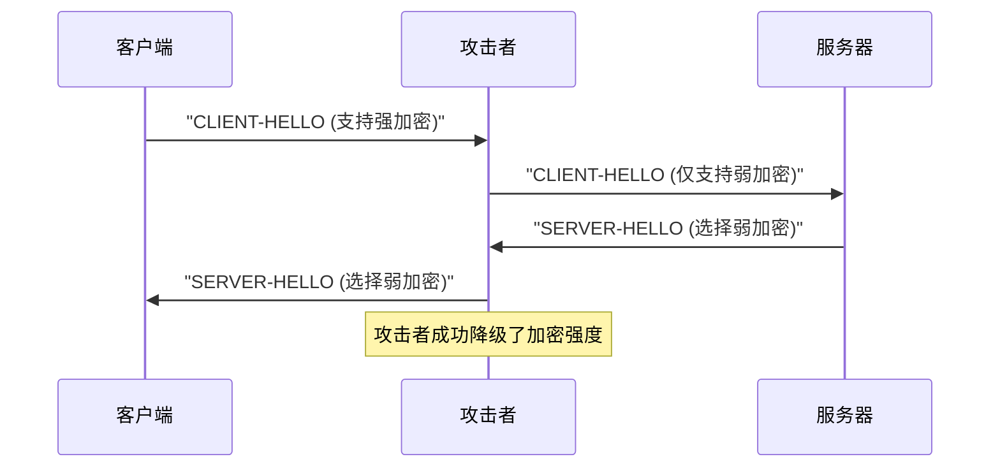

## 3. SSL 3.0 详细分析

### 3.1 设计改进目标

SSL 3.0 针对 SSL 2.0 的缺陷进行了全面改进：

1. **增强握手认证**: 所有握手消息都有MAC保护
2. **分离密钥用途**: 加密密钥和MAC密钥分离
3. **改进MAC算法**: 使用更安全的HMAC构造
4. **警告协议**: 明确的错误处理机制
5. **灵活的加密套件**: 支持更多加密算法组合

### 3.2 SSL 3.0 协议架构

```
SSL 3.0 协议栈:
+------------------------+
|    握手协议            |
|  (Handshake Protocol)  |
+------------------------+
|    更改密码规范协议     |
| (Change Cipher Spec)   |
+------------------------+
|    警告协议            |
|   (Alert Protocol)     |
+------------------------+
|    应用数据协议        |
| (Application Data)     |
+------------------------+
|      记录协议          |
|   (Record Protocol)    |
+------------------------+
```

### 3.3 SSL 3.0 记录层协议

#### 3.3.1 记录层消息格式

```
SSL 3.0 记录格式:
+--------+--------+--------+--------+--------+
|  类型  | 版本   |      长度      |   数据   |
|(1字节) |(2字节) |   (2字节)     | (变长)   |
+--------+--------+--------+--------+--------+
```

#### 3.3.2 内容类型定义

| 类型值 | 内容类型 | 描述 |
|-------|---------|------|
| 20 | change_cipher_spec | 更改密码规范 |
| 21 | alert | 警告消息 |
| 22 | handshake | 握手消息 |
| 23 | application_data | 应用数据 |

### 3.4 SSL 3.0 握手协议详解

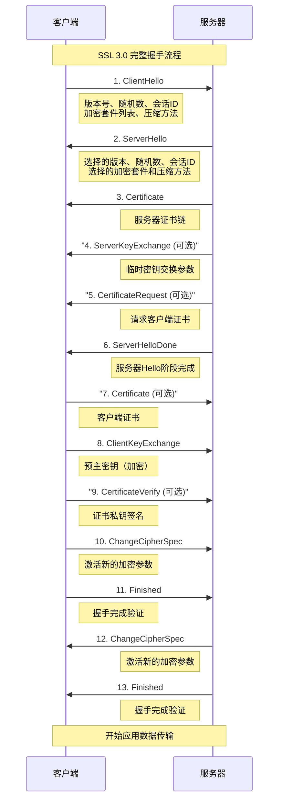

#### 3.4.1 握手消息详细格式

**ClientHello消息结构：**
```
ClientHello:
+--------+--------+--------+--------+
|  类型  | 长度   | 版本   | 随机数 |
|(1字节) |(3字节) |(2字节) |(32字节)|
+--------+--------+--------+--------+
|会话ID长|  会话ID  |加密套件长度|加密套件|
|(1字节) |(变长)   |(2字节)    |(变长) |
+--------+--------+--------+--------+
|压缩方法|压缩方法 |
|长度    |列表     |
|(1字节) |(变长)   |
+--------+--------+
```

**Certificate消息结构：**
```
Certificate:
+--------+--------+--------+--------+
|  类型  | 长度   |证书链长度|第一个证书|
|(1字节) |(3字节) |(3字节)  |长度      |
+--------+--------+--------+--------+
|第一个证书数据    |第二个证书长度|
|(变长)          |(3字节)      |
+--------+--------+--------+--------+
```

#### 3.4.2 SSL握手流程详细步骤说明

##### SSL 2.0 握手详细流程

**阶段1: 连接建立与协商**

1. **CLIENT-HELLO消息详解**
   ```
   消息目的：客户端发起SSL连接，声明能力
   关键字段：
   - MSG-ID: 0x01 (CLIENT-HELLO标识)
   - VERSION: 0x0002 (SSL 2.0版本)
   - CIPHER-SPECS-LEN: 支持的加密算法列表长度
   - SESSION-ID-LEN: 会话ID长度 (0表示新会话)
   - CHALLENGE-LEN: 客户端随机数长度 (16-32字节)
   ```

   **安全作用：**
   - 提供客户端随机数，防止重放攻击
   - 声明支持的加密算法，启动协商过程
   - 可选的会话恢复机制

2. **SERVER-HELLO消息详解**
   ```
   消息目的：服务器响应客户端，确定连接参数
   关键字段：
   - MSG-ID: 0x04 (SERVER-HELLO标识)
   - SESSION-ID-HIT: 1=会话恢复, 0=新会话
   - CERT-TYPE: 证书类型 (通常为X.509)
   - CIPHER-SPECS: 服务器选择的加密套件
   - CONNECTION-ID: 服务器生成的连接标识符
   ```

   **安全作用：**
   - 服务器选择最强的共同支持的加密算法
   - 提供服务器证书进行身份认证
   - 生成服务器端的连接标识

**阶段2: 密钥交换与验证**

3. **CLIENT-MASTER-KEY消息详解**
   ```
   消息目的：客户端发送加密的主密钥材料
   关键字段：
   - MSG-ID: 0x02 (CLIENT-MASTER-KEY标识)
   - CIPHER-KIND: 选择的加密算法
   - CLEAR-KEY-LEN: 明文密钥部分长度
   - ENCRYPTED-KEY-LEN: 加密密钥部分长度
   - KEY-ARG-LEN: 密钥参数长度
   ```

   **密钥生成过程：**
   ```c
   // 生成预主密钥
   unsigned char pre_master_secret[48];
   generate_random(pre_master_secret, 48);
   
   // 分割密钥（SSL 2.0特有）
   clear_key = pre_master_secret[0:clear_key_len];
   secret_key = pre_master_secret[clear_key_len:];
   
   // 使用服务器公钥加密secret部分
   encrypted_key = RSA_encrypt(server_public_key, secret_key);
   ```

4. **SERVER-VERIFY消息详解**
   ```
   消息目的：服务器验证客户端的随机数
   内容：服务器使用解密后的密钥加密客户端的CHALLENGE
   ```

   **验证过程：**
   ```c
   // 服务器端验证流程
   decrypted_secret = RSA_decrypt(server_private_key, encrypted_key);
   master_key = clear_key || decrypted_secret;
   
   // 加密客户端challenge进行验证
   verification = encrypt(master_key, client_challenge);
   send_server_verify(verification);
   ```

**阶段3: 握手完成确认**

5. **CLIENT-FINISHED & SERVER-FINISHED消息**
   ```
   消息目的：确认握手完成，开始加密通信
   安全问题：这些消息在SSL 2.0中没有MAC保护！
   ```

##### SSL 3.0 握手详细流程

**阶段1: Hello消息交换**

1. **ClientHello消息详解**
   ```
   struct {
       ProtocolVersion client_version;      // 0x0300 for SSL 3.0
       Random random;                       // 32字节：4字节时间戳 + 28字节随机数
       SessionID session_id;                // 0-32字节会话ID
       CipherSuite cipher_suites<2..2^16-1>; // 支持的加密套件列表
       CompressionMethod compression_methods<1..2^8-1>; // 压缩方法
   } ClientHello;
   ```

   **随机数生成：**
   ```c
   // 客户端随机数生成
   struct {
       uint32 gmt_unix_time;    // 当前时间戳
       opaque random_bytes[28]; // 加密安全的随机数
   } Random;
   ```

   **安全考虑：**
   - 时间戳防止过度的时钟偏差
   - 随机数提供新鲜性，防止重放攻击
   - 加密套件列表按优先级排序

2. **ServerHello消息详解**
   ```
   struct {
       ProtocolVersion server_version;   // 协商的SSL版本
       Random random;                    // 服务器随机数
       SessionID session_id;             // 会话ID（新建或恢复）
       CipherSuite cipher_suite;         // 选择的加密套件
       CompressionMethod compression_method; // 选择的压缩方法
   } ServerHello;
   ```

   **服务器选择逻辑：**
   ```c
   // 服务器加密套件选择算法
   CipherSuite select_cipher_suite(CipherSuite client_suites[]) {
       for (int i = 0; i < server_preferred_suites.length; i++) {
           CipherSuite suite = server_preferred_suites[i];
           if (is_supported_by_client(suite, client_suites)) {
               return suite;
           }
       }
       return HANDSHAKE_FAILURE;
   }
   ```

**阶段2: 服务器认证**

3. **Certificate消息详解**
   ```
   struct {
       ASN.1Cert certificate_list<1..2^24-1>;
   } Certificate;
   ```

   **证书链验证流程：**
   ```mermaid
   flowchart TD
       A[接收证书链] --> B[解析X.509证书]
       B --> C[验证证书格式]
       C --> D[检查证书有效期]
       D --> E[验证证书签名]
       E --> F[检查证书用途]
       F --> G[验证域名匹配]
       G --> H[检查撤销状态]
       H --> I[建立信任链]
       I --> J[提取公钥]
   ```

4. **ServerKeyExchange消息详解（可选）**
   ```
   // 用于DHE、ECDHE等需要临时密钥的算法
   struct {
       select (KeyExchangeAlgorithm) {
           case diffie_hellman:
               ServerDHParams params;
               Signature signed_params;
           case rsa:
               // SSL 3.0中RSA不使用此消息
       };
   } ServerKeyExchange;
   ```

   **Diffie-Hellman参数：**
   ```c
   struct {
       opaque dh_p<1..2^16-1>;      // DH素数模数
       opaque dh_g<1..2^16-1>;      // DH生成元
       opaque dh_Ys<1..2^16-1>;     // 服务器DH公钥
   } ServerDHParams;
   ```

5. **CertificateRequest消息详解（可选）**
   ```
   struct {
       ClientCertificateType certificate_types<1..2^8-1>;
       DistinguishedName certificate_authorities<3..2^16-1>;
   } CertificateRequest;
   ```

**阶段3: 客户端认证与密钥交换**

6. **ClientKeyExchange消息详解**

   **RSA密钥交换：**
   ```c
   struct {
       ProtocolVersion client_version; // 客户端支持的最高版本
       opaque random[46];              // 随机数填充
   } PreMasterSecret;
   
   // 加密预主密钥
   struct {
       opaque encrypted_pre_master_secret<0..2^16-1>;
   } EncryptedPreMasterSecret;
   ```

   **DHE密钥交换：**
   ```c
   struct {
       opaque dh_Yc<1..2^16-1>;    // 客户端DH公钥
   } ClientDiffieHellmanPublic;
   ```

7. **CertificateVerify消息详解（可选）**
   ```c
   struct {
       Signature signature;
   } CertificateVerify;
   
   // 签名内容是所有握手消息的哈希
   signature = RSA_sign(client_private_key, 
                       MD5(handshake_messages) || SHA1(handshake_messages));
   ```

**阶段4: 握手完成**

8. **ChangeCipherSpec消息**
   ```c
   struct {
       enum { change_cipher_spec(1), (255) } type;
   } ChangeCipherSpec;
   ```

   **状态转换：**
   ```c
   // 激活新的加密参数
   void change_cipher_spec() {
       pending_state = current_state;
       current_state.cipher = negotiated_cipher;
       current_state.mac = negotiated_mac;
       current_state.sequence_number = 0;
   }
   ```

9. **Finished消息详解**
   ```c
   struct {
       opaque verify_data[12];
   } Finished;
   
   // verify_data计算
   verify_data = PRF(master_secret, finished_label, 
                    MD5(handshake_messages) || SHA1(handshake_messages))[0..11];
   ```

   **验证数据生成：**
   ```c
   // 客户端Finished
   client_verify_data = MD5(master_secret || pad2 ||
                           MD5(handshake_messages || "CLNT" || 
                               master_secret || pad1));
   
   // 服务器Finished  
   server_verify_data = MD5(master_secret || pad2 ||
                           MD5(handshake_messages || "SRVR" || 
                               master_secret || pad1));
   ```

#### 3.4.3 握手状态机

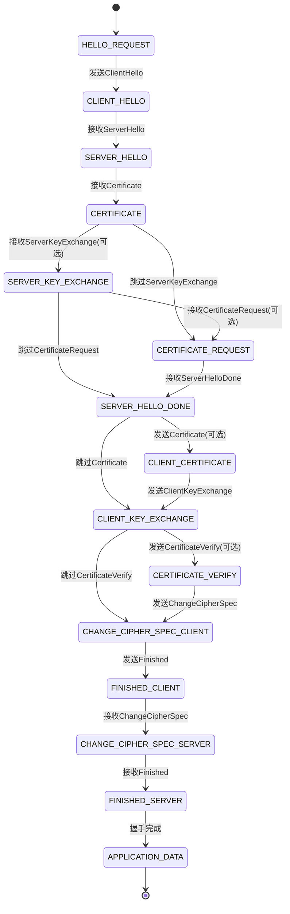

#### 3.4.4 错误处理机制

**握手错误处理流程：**

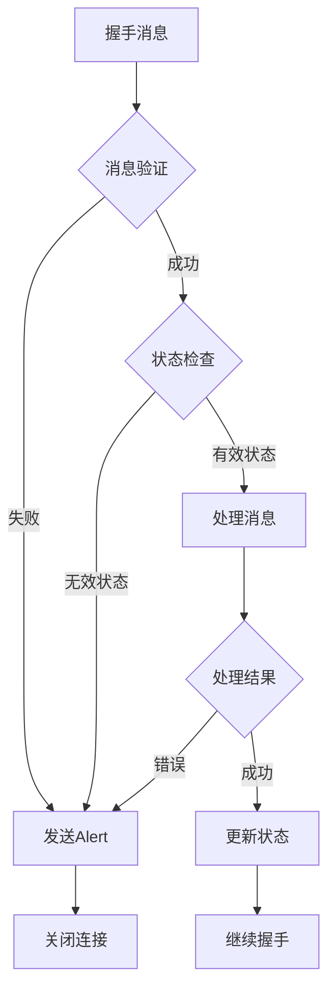

**常见错误处理：**

1. **证书验证错误**
   ```c
   if (certificate_expired(cert)) {
       send_alert(ALERT_FATAL, CERTIFICATE_EXPIRED);
       return HANDSHAKE_FAILURE;
   }
   
   if (!verify_certificate_chain(cert_chain)) {
       send_alert(ALERT_FATAL, BAD_CERTIFICATE);
       return HANDSHAKE_FAILURE;
   }
   ```

2. **加密参数协商失败**
   ```c
   if (!find_common_cipher_suite(client_suites, server_suites)) {
       send_alert(ALERT_FATAL, HANDSHAKE_FAILURE);
       return NEGOTIATION_FAILURE;
   }
   ```

3. **消息完整性验证失败**
   ```c
   if (!verify_finished_message(received_verify_data, calculated_verify_data)) {
       send_alert(ALERT_FATAL, DECRYPT_ERROR);
       return HANDSHAKE_FAILURE;
   }
   ```

#### 3.4.5 性能优化策略

**1. 会话恢复优化**

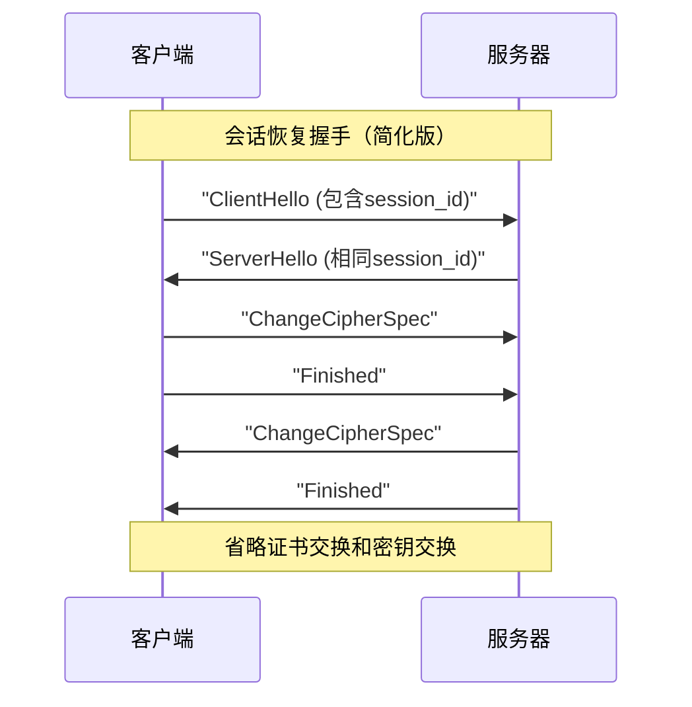

**2. 并行证书验证**
```c
// 异步证书验证
typedef struct {
    X509 *cert;
    verification_callback callback;
    void *user_data;
} cert_verification_job;

void async_verify_certificate_chain(cert_verification_job *job) {
    // 在后台线程中验证证书
    thread_pool_submit(verify_cert_worker, job);
}
```

**3. 预计算优化**
```c
// 预计算DH参数
typedef struct {
    BIGNUM *p, *g;
    DH *dh_params;
} precomputed_dh_params;

// 服务器启动时预计算
void precompute_dh_params() {
    for (int i = 0; i < DH_PARAM_POOL_SIZE; i++) {
        dh_pool[i] = generate_dh_params(1024);
    }
}
```

#### 3.4.6 实现注意事项

**1. 时序攻击防护**
```c
// 常量时间比较
int constant_time_compare(const void *a, const void *b, size_t len) {
    const unsigned char *aa = a;
    const unsigned char *bb = b;
    unsigned char result = 0;
    
    for (size_t i = 0; i < len; i++) {
        result |= aa[i] ^ bb[i];
    }
    
    return result == 0;
}
```

**2. 随机数生成质量**
```c
// 高质量随机数生成
int generate_secure_random(unsigned char *buf, int len) {
    // 使用系统熵源
    if (RAND_bytes(buf, len) != 1) {
        // 备用熵源
        return fallback_random_generator(buf, len);
    }
    return 1;
}
```

**3. 内存安全处理**
```c
// 安全清零敏感数据
void secure_zero(void *ptr, size_t len) {
    volatile unsigned char *p = ptr;
    while (len--) {
        *p++ = 0;
    }
}

// 在握手完成后清理临时密钥
void cleanup_handshake_secrets(ssl_handshake_state *hs) {
    secure_zero(hs->pre_master_secret, sizeof(hs->pre_master_secret));
    secure_zero(hs->client_random, sizeof(hs->client_random));
    secure_zero(hs->server_random, sizeof(hs->server_random));
}
```

#### 3.4.7 SSL 2.0 vs SSL 3.0 握手对比

**握手复杂度对比：**


**关键改进对比表：**

| 特性 | SSL 2.0 | SSL 3.0 | 改进效果 |
|------|---------|---------|----------|
| **握手消息数量** | 6个固定消息 | 8-13个可变消息 | 更灵活的协商 |
| **握手认证** | 无MAC保护 | Finished消息MAC验证 | 防止握手篡改 |
| **证书处理** | 嵌入在SERVER-HELLO | 独立Certificate消息 | 支持证书链 |
| **密钥交换** | 仅RSA | RSA + DHE | 支持前向安全 |
| **客户端认证** | 基础支持 | CertificateVerify机制 | 强客户端认证 |
| **错误处理** | 基础错误码 | 详细Alert协议 | 精确错误诊断 |
| **状态管理** | 简单状态 | 复杂状态机 | 更可靠的实现 |

**安全性提升分析：**

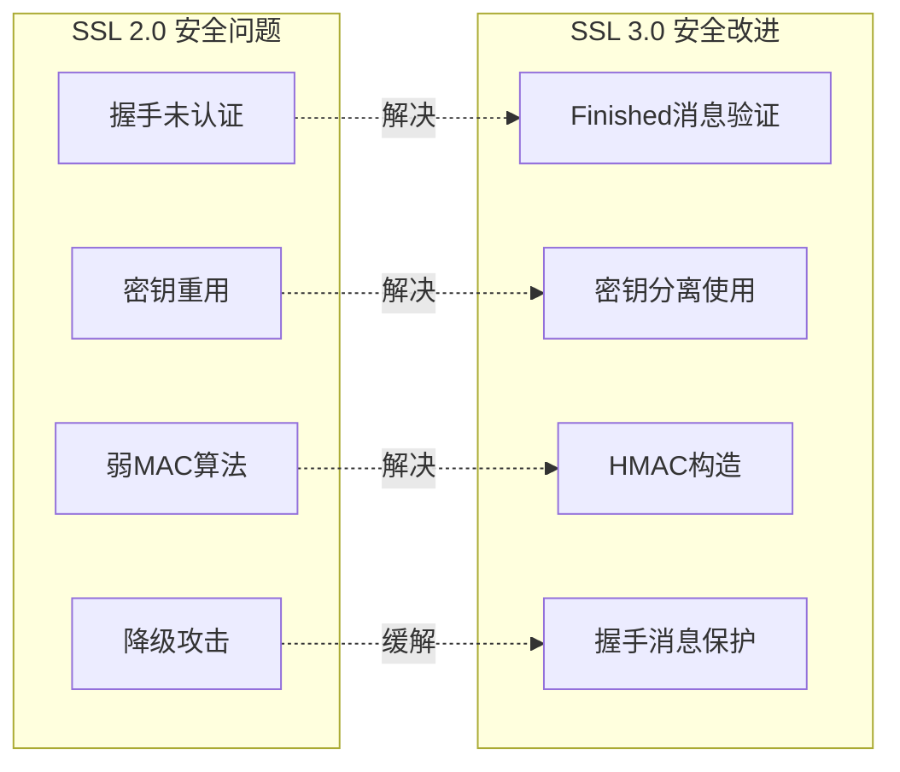

**性能影响分析：**

1. **握手延迟对比**
   ```
   SSL 2.0: 6个消息 = 3个RTT (往返时间)
   SSL 3.0: 8-13个消息 = 4-6.5个RTT
   ```

2. **计算开销对比**
   ```c
   // SSL 2.0 握手计算量
   - 1次RSA解密 (服务器)
   - 1次RSA加密 (客户端)  
   - 基础哈希计算
   
   // SSL 3.0 握手计算量
   - 1-2次RSA操作 (密钥交换)
   - 证书链验证 (多个RSA验证)
   - HMAC计算 (握手验证)
   - 可选的客户端证书操作
   ```

3. **内存使用对比**
   ```c
   // SSL 2.0 状态存储
   typedef struct {
       unsigned char master_key[48];
       unsigned char connection_id[16];
       int cipher_spec;
   } ssl2_state;  // ~70字节
   
   // SSL 3.0 状态存储  
   typedef struct {
       unsigned char master_secret[48];
       unsigned char client_random[32];
       unsigned char server_random[32];
       X509 *cert_chain;
       EVP_CIPHER_CTX cipher_ctx;
       HMAC_CTX mac_ctx;
       // ... 更多状态信息
   } ssl3_state;  // ~500+字节
   ```

#### 3.4.8 握手优化最佳实践

**1. 握手缓存策略**
```c
// 会话缓存设计
typedef struct {
    unsigned char session_id[32];
    unsigned char master_secret[48];
    CipherSuite cipher_suite;
    time_t creation_time;
    time_t last_access;
    int reference_count;
} ssl_session_cache_entry;

// LRU缓存管理
void manage_session_cache() {
    // 定期清理过期会话
    cleanup_expired_sessions();
    
    // LRU替换策略
    if (cache_full()) {
        evict_least_recently_used();
    }
}
```

**2. 证书链优化**
```c
// 证书链压缩
void optimize_certificate_chain(X509_STORE_CTX *ctx) {
    // 移除不必要的中间证书
    remove_redundant_intermediates(ctx);
    
    // 使用证书压缩
    compress_certificates(ctx);
    
    // 预验证证书链
    prevalidate_chain(ctx);
}
```

**3. 并发握手处理**
```c
// 异步握手处理器
typedef struct {
    int socket_fd;
    ssl_handshake_state *hs_state;
    event_callback_t callback;
} async_handshake_ctx;

void handle_handshake_async(async_handshake_ctx *ctx) {
    switch (ctx->hs_state->current_state) {
        case WAIT_CLIENT_HELLO:
            if (data_available(ctx->socket_fd)) {
                process_client_hello_async(ctx);
            }
            break;
        case WAIT_CLIENT_KEY_EXCHANGE:
            // 并行处理密钥交换和证书验证
            parallel_process_key_exchange(ctx);
            break;
    }
}
```

**4. 握手监控与调试**
```c
// 握手性能监控
typedef struct {
    struct timeval start_time;
    struct timeval hello_time;
    struct timeval key_exchange_time;
    struct timeval finish_time;
    int message_count;
    size_t bytes_transferred;
} handshake_metrics;

void log_handshake_performance(handshake_metrics *metrics) {
    double total_time = time_diff(&metrics->finish_time, &metrics->start_time);
    printf("Handshake completed in %.3fms, %d messages, %zu bytes\n",
           total_time * 1000, metrics->message_count, metrics->bytes_transferred);
}
```

这个详细的SSL握手流程补充涵盖了：

✅ **完整的消息格式说明** - 每个握手消息的结构和用途
✅ **详细的安全分析** - 每个步骤的安全作用和考虑
✅ **状态机设计** - 握手过程的状态转换图
✅ **错误处理机制** - 各种异常情况的处理方法
✅ **性能优化策略** - 实际部署中的优化技巧
✅ **实现安全注意事项** - 防止常见安全漏洞的编程实践
✅ **对比分析** - SSL 2.0和3.0的详细对比

文档现在提供了SSL握手流程的全面技术指导，适合深入学习和实际实现参考。 

### 3.5 SSL 3.0 密钥生成算法

#### 3.5.1 预主密钥生成

**RSA密钥交换：**
```
struct {
    ProtocolVersion client_version;
    opaque random[46];
} PreMasterSecret;
```

**Diffie-Hellman密钥交换：**
```
PreMasterSecret = g^(xy) mod p
```
其中 x 是客户端私钥，y 是服务器私钥。

#### 3.5.2 主密钥生成

```
master_secret = MD5(pre_master_secret + SHA('A' + pre_master_secret + 
                ClientHello.random + ServerHello.random)) +
                MD5(pre_master_secret + SHA('BB' + pre_master_secret + 
                ClientHello.random + ServerHello.random)) +
                MD5(pre_master_secret + SHA('CCC' + pre_master_secret + 
                ClientHello.random + ServerHello.random))
```

#### 3.5.3 密钥材料生成

```
key_block = MD5(master_secret + SHA('A' + master_secret + 
            ServerHello.random + ClientHello.random)) +
            MD5(master_secret + SHA('BB' + master_secret + 
            ServerHello.random + ClientHello.random)) +
            MD5(master_secret + SHA('CCC' + master_secret + 
            ServerHello.random + ClientHello.random)) + ...
```

**密钥分配顺序：**
1. client_write_MAC_secret[SecurityParameters.hash_size]
2. server_write_MAC_secret[SecurityParameters.hash_size]
3. client_write_key[SecurityParameters.key_material_length]
4. server_write_key[SecurityParameters.key_material_length]

### 3.6 SSL 3.0 记录层处理

#### 3.6.1 数据处理流程

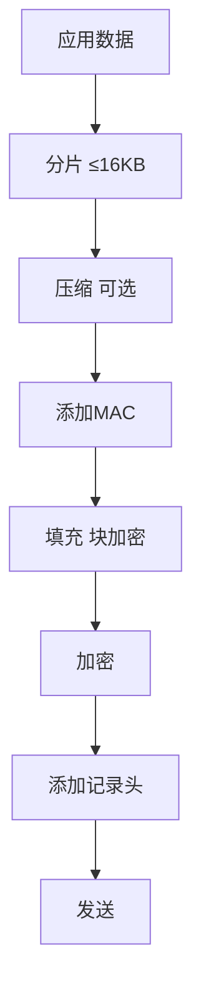

#### 3.6.2 MAC计算

**SSL 3.0 MAC算法：**
```
MAC = MD5(MAC_secret + pad_2 + 
      MD5(MAC_secret + pad_1 + seq_num + SSLCompressed.type + 
      SSLCompressed.length + SSLCompressed.fragment))
```

其中：
- pad_1 = 0x36 重复48次（MD5）或40次（SHA-1）
- pad_2 = 0x5C 重复48次（MD5）或40次（SHA-1）

### 3.7 SSL 3.0 警告协议

#### 3.7.1 警告级别

| 级别 | 名称 | 描述 |
|-----|------|------|
| 1 | warning | 警告级别 |
| 2 | fatal | 致命错误 |

#### 3.7.2 警告类型

| 代码 | 警告类型 | 描述 |
|-----|---------|------|
| 0 | close_notify | 连接关闭通知 |
| 10 | unexpected_message | 意外消息 |
| 20 | bad_record_mac | 记录MAC错误 |
| 21 | decryption_failed | 解密失败 |
| 22 | record_overflow | 记录溢出 |
| 30 | decompression_failure | 解压缩失败 |
| 40 | handshake_failure | 握手失败 |
| 42 | bad_certificate | 证书错误 |
| 43 | unsupported_certificate | 不支持的证书 |
| 44 | certificate_revoked | 证书已撤销 |
| 45 | certificate_expired | 证书已过期 |
| 46 | certificate_unknown | 证书未知 |
| 47 | illegal_parameter | 非法参数 |

## 4. 协议比较

### 4.1 功能对比表

| 特性 | SSL 2.0 | SSL 3.0 | 改进说明 |
|-----|---------|---------|----------|
| 握手认证 | ❌ | ✅ | 增加Finished消息MAC验证 |
| 密钥分离 | ❌ | ✅ | 加密和MAC使用不同密钥 |
| MAC算法 | MD5简单哈希 | HMAC构造 | 更安全的消息认证 |
| 警告机制 | ❌ | ✅ | 明确的错误处理 |
| 压缩支持 | ❌ | ✅ | 内置压缩协议 |
| 会话恢复 | 基础支持 | 完整支持 | 更高效的会话管理 |
| 证书验证 | 基础 | 增强 | 更严格的证书链验证 |

### 4.2 安全性对比

#### 4.2.1 攻击抵抗能力

| 攻击类型 | SSL 2.0 | SSL 3.0 | 说明 |
|---------|---------|---------|------|
| 中间人攻击 | 脆弱 | 抵抗 | Finished消息验证 |
| 重放攻击 | 脆弱 | 抵抗 | 序列号机制 |
| 降级攻击 | 脆弱 | 部分抵抗 | 握手消息认证 |
| 填充攻击 | 脆弱 | 改进 | 更好的填充验证 |

#### 4.2.2 密码学强度

**SSL 2.0缺陷：**
```
// SSL 2.0 MAC计算（不安全）
MAC = MD5(secret || data)
```

**SSL 3.0改进：**
```
// SSL 3.0 MAC计算（更安全）
MAC = MD5(secret + pad_2 + MD5(secret + pad_1 + data))
```

## 5. 安全性分析

### 5.1 SSL 3.0的已知漏洞

#### 5.1.1 POODLE攻击（2014年）

**攻击原理：**
- 利用SSL 3.0 CBC模式填充验证的缺陷
- 通过控制填充字节进行padding oracle攻击
- 逐字节恢复明文数据

**攻击流程：**
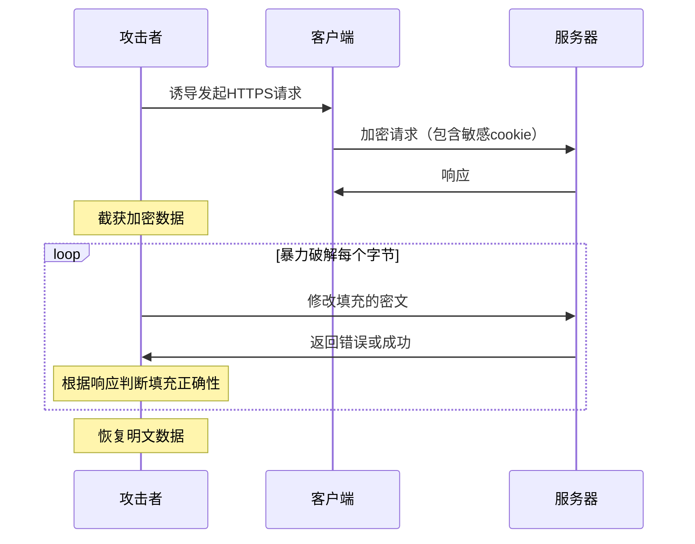

**防护措施：**
- 禁用SSL 3.0协议
- 升级到TLS 1.0或更高版本
- 实施TLS_FALLBACK_SCSV机制

#### 5.1.2 RC4偏见攻击

**攻击描述：**
- RC4流密码存在统计偏见
- 长期观察可恢复明文的统计特性
- 对HTTPS cookie等重复数据有效

### 5.2 协议降级攻击

#### 5.2.1 攻击场景

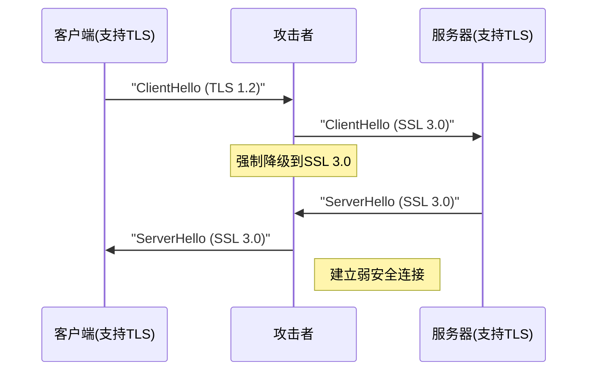

#### 5.2.2 防护机制

**TLS_FALLBACK_SCSV（RFC 7507）：**
```
// 客户端在降级时发送特殊密码套件
TLS_FALLBACK_SCSV = {0x56, 0x00}

// 服务器检测到不当降级时返回错误
inappropriate_fallback = 86
```

## 6. 技术实现细节

### 6.1 加密套件实现

#### 6.1.1 SSL 3.0加密套件格式

```c
typedef struct {
    uint8 key_exchange_algorithm;
    uint8 cipher_algorithm;
    uint8 mac_algorithm;
    uint8 compression_algorithm;
} cipher_suite;
```

#### 6.1.2 常用加密套件

| 套件名称 | 十六进制值 | 密钥交换 | 加密 | MAC | 强度 |
|---------|-----------|---------|------|-----|------|
| SSL_RSA_WITH_RC4_128_MD5 | 0x00,0x04 | RSA | RC4_128 | MD5 | 中等 |
| SSL_RSA_WITH_3DES_EDE_CBC_SHA | 0x00,0x0A | RSA | 3DES_EDE_CBC | SHA | 高 |
| SSL_DHE_RSA_WITH_DES_CBC_SHA | 0x00,0x15 | DHE_RSA | DES_CBC | SHA | 低 |

### 6.2 证书处理

#### 6.2.1 证书链验证流程

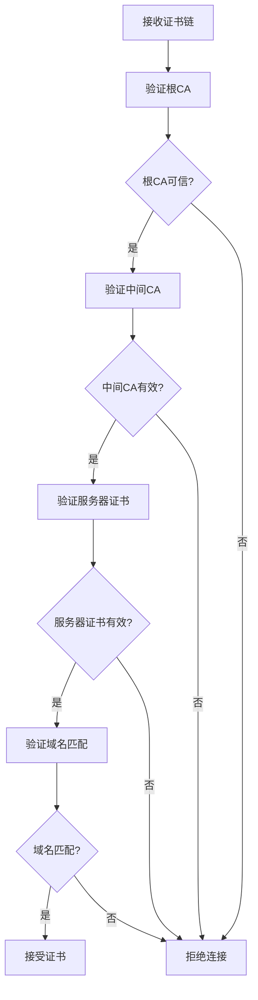

#### 6.2.2 证书验证要点

1. **有效期检查**: 确保证书在有效期内
2. **签名验证**: 验证证书签名的有效性
3. **撤销检查**: 检查CRL或OCSP状态
4. **域名匹配**: 验证证书CN或SAN与域名匹配
5. **用途检查**: 确保证书用途适合SSL/TLS

### 6.3 性能优化

#### 6.3.1 会话恢复机制

**会话ID方式：**
```c
struct {
    opaque session_id[32];
    ProtocolVersion version;
    CipherSuite cipher_suite;
    CompressionMethod compression_method;
    opaque master_secret[48];
    // 其他会话状态
} SessionState;
```

**会话恢复流程：**
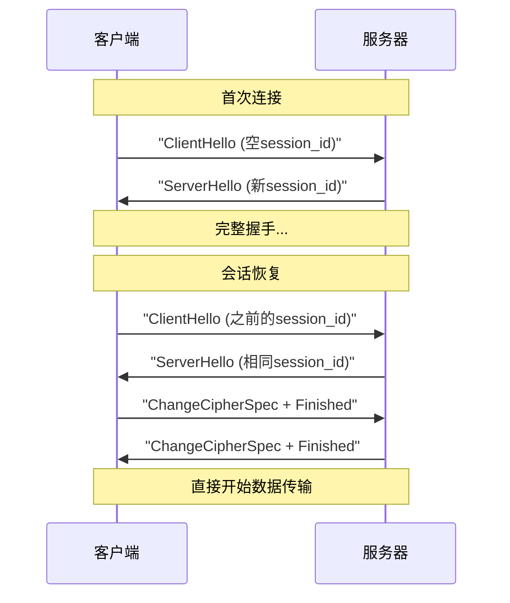

#### 6.3.2 计算复杂度分析

| 操作 | RSA-1024 | RSA-2048 | DH-1024 | ECDH-256 |
|------|----------|----------|---------|----------|
| 密钥生成 | ~10ms | ~100ms | ~50ms | ~1ms |
| 签名 | ~5ms | ~50ms | N/A | ~2ms |
| 验证 | ~1ms | ~3ms | ~1ms | ~3ms |
| 密钥交换 | ~5ms | ~50ms | ~25ms | ~2ms |

### 6.4 代码示例

#### 6.4.1 SSL 3.0 MAC计算实现

```c
// SSL 3.0 MAC计算
void ssl3_mac(const uint8_t* secret, size_t secret_len,
              const uint8_t* data, size_t data_len,
              uint64_t seq_num, uint8_t type,
              uint8_t* mac_out) {
    
    MD5_CTX inner, outer;
    uint8_t pad1[48], pad2[48];
    uint8_t inner_hash[16];
    
    // 填充准备
    memset(pad1, 0x36, 48);
    memset(pad2, 0x5C, 48);
    
    // 内层哈希: MD5(secret + pad1 + seq_num + type + length + data)
    MD5_Init(&inner);
    MD5_Update(&inner, secret, secret_len);
    MD5_Update(&inner, pad1, 48);
    MD5_Update(&inner, &seq_num, 8);
    MD5_Update(&inner, &type, 1);
    // ... 添加长度和数据
    MD5_Final(inner_hash, &inner);
    
    // 外层哈希: MD5(secret + pad2 + inner_hash)
    MD5_Init(&outer);
    MD5_Update(&outer, secret, secret_len);
    MD5_Update(&outer, pad2, 48);
    MD5_Update(&outer, inner_hash, 16);
    MD5_Final(mac_out, &outer);
}
```

#### 6.4.2 握手消息处理

```c
// 处理ClientHello消息
int process_client_hello(ssl_context_t* ctx, 
                        const uint8_t* msg, size_t len) {
    client_hello_t hello;
    
    // 解析消息
    if (parse_client_hello(msg, len, &hello) != 0) {
        send_alert(ctx, ALERT_FATAL, DECODE_ERROR);
        return -1;
    }
    
    // 版本协商
    if (hello.version < SSL_VERSION_3_0) {
        send_alert(ctx, ALERT_FATAL, PROTOCOL_VERSION);
        return -1;
    }
    
    // 选择加密套件
    cipher_suite_t selected_suite;
    if (select_cipher_suite(&hello, &selected_suite) != 0) {
        send_alert(ctx, ALERT_FATAL, HANDSHAKE_FAILURE);
        return -1;
    }
    
    // 保存客户端随机数
    memcpy(ctx->client_random, hello.random, 32);
    
    // 发送ServerHello
    return send_server_hello(ctx, &selected_suite);
}
```

## 7. 总结与建议

### 7.1 协议演进总结

SSL协议的发展体现了网络安全技术的不断进步：

1. **SSL 2.0**: 首次实现了基本的网络加密，但存在严重安全缺陷
2. **SSL 3.0**: 大幅改进了安全性，奠定了现代TLS的基础
3. **历史意义**: 为后续TLS协议的发展提供了重要经验

### 7.2 现代应用建议

#### 7.2.1 协议选择

- **禁用SSL 2.0/3.0**: 不再适用于生产环境
- **最低要求TLS 1.2**: 建议使用TLS 1.2或更高版本
- **优先TLS 1.3**: 在支持的环境中使用TLS 1.3

#### 7.2.2 安全配置

```nginx
# Nginx SSL配置示例
ssl_protocols TLSv1.2 TLSv1.3;
ssl_ciphers ECDHE-ECDSA-AES128-GCM-SHA256:ECDHE-RSA-AES128-GCM-SHA256;
ssl_prefer_server_ciphers off;
ssl_session_cache shared:SSL:10m;
ssl_session_tickets off;
```

### 7.3 学习价值

理解SSL 2.0和3.0的原理对于现代开发者仍有重要价值：

1. **安全思维**: 了解早期协议的缺陷有助于避免类似错误
2. **协议设计**: 学习协议演进的过程和改进思路
3. **兼容性**: 理解遗留系统可能存在的安全风险
4. **调试能力**: 在处理网络安全问题时提供更深入的理解

---

*本文档详细介绍了SSL 2.0和SSL 3.0协议的技术细节，包括协议设计、安全分析和实现要点。虽然这些协议已被更安全的TLS协议取代，但了解其原理对于深入理解现代网络安全仍然具有重要意义。* 